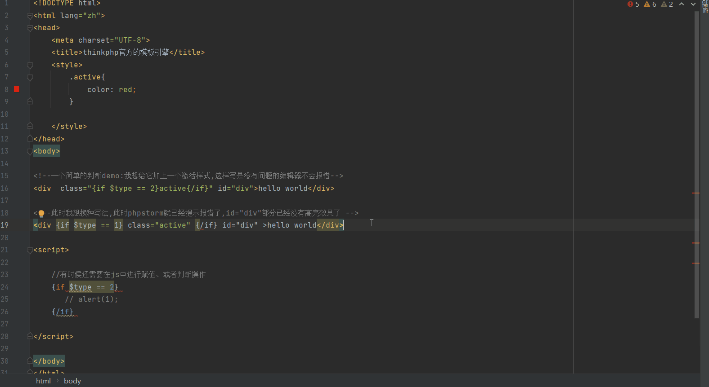
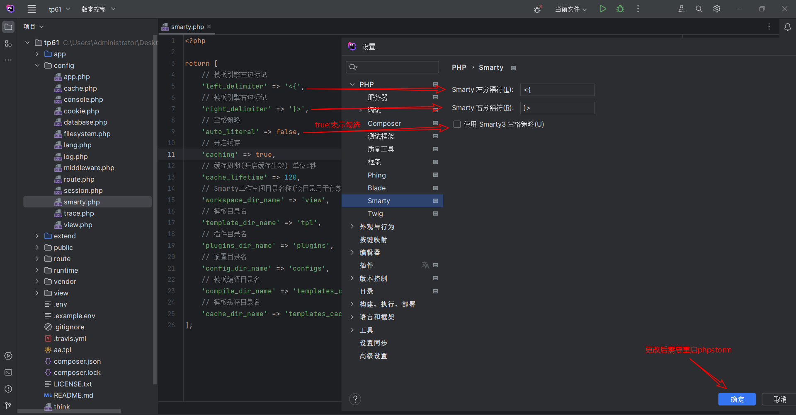

# think-smarty

基于thinkphp6封装的smarty模板引擎。

- [smarty官网文档](https://www.smarty.net/docs/zh_CN/)
- [smarty-github文档](https://smarty-php.github.io/smarty/)
- [smarty-github仓库](https://github.com/smarty-php/smarty)


## 为什么要封装think-smarty

虽然现在流行前后端分离，但是有时难免要用一下mvc这种开发方式做一些小项目,但是thinkphp的模板引擎(ThinkTemplate)在
phpstorm中格式化html代码时会各种代码错乱和报错,开发起来特别闹心。

无图无真相

### ThinkTemplate



### think-smarty


## think-smarty的优点

- smarty 是一款历史较长、经过多年发展和优化的模板引擎
- smarty由于长期稳定的使用和开发，Smarty 可以提供较高的稳定性和可靠性
- smarty相对于市面上的其它php模板引擎(Blade、Twig、ThinkTemplate)效率更高
- smarty知名度高,各大编辑器、IDE都有相对应的插件支持,phpstorm官方内置支持smarty语法高亮，格式化，折叠
- think-smarty会自动根据smarty官方的更新而下载最新的稳定版
- think-smarty简化手动集成的繁琐步骤、配置，开箱即用
- think-smarty麻雀虽小,五脏俱全(封装但没有阉割smarty的功能)
- thinkphp框架从6.x开始官方默认就不集成模板引擎,意味着你可以安装自己喜欢的模板引擎(think-smarty是个不错的选择)


# 安装

```
composer require ajiho/think-smarty
```

# 配置文件

/config/smarty.php

```php
<?php

return [
    // 开启缓存
    'caching' => false,
    // 缓存周期(开启缓存生效)
    'cache_lifetime' => 120,
    // 空格策略
    'auto_literal' => false,
    // 模板引擎左边标记
    'left_delimiter' => '<{',
    // 模板引擎右边标记
    'right_delimiter' => '}>',
];
```

# 主要方法

| 函数名 | 描述 |
|--|--|
| smarty | 返回smarty对象,可以根据smarty官方文档调用一些方法 |
| smarty_assign | 给视图文件赋值 |
| smarty_fetch | 返回一个模板输出的内容(HTML代码)，而不是直接显示出来 |
| smarty_display | 返回一个response对象 |


# smarty配置说明

| 配置项 | 路径 |
|--|--|
| 模板目录 | app_path() . 'view/' |
| 缓存目录 | runtime_path() . 'smarty/cache/' |
| 编译目录 | runtime_path() . 'smarty/compile/' |
| 插件目录 | app_path() . 'smarty/plugins/' |
| 配置目录 | app_path() . 'smarty/configs/' |


# phpstorm设置

然后根据配置文件`smarty.php`对`phpstorm`进行相应的设置,就可以舒适的开发啦

`ctrl+alt+s`，搜索`smarty`就可以打开如下设置面板



注意:设置后要重启phpstorm才会生效


# 使用

## 开启think-smarty

用法和tp6自带的`think\middleware\SessionInit`中间件一样，需要自己开启，
且`api`应用通常也是不需要模板引擎的。

```
\ajiho\middleware\SmartyInit::class
```

## 基本演示

启用smarty


直接输出视图


视图页面


输出效果


报错


# 反馈

开发过程发现有任何问题，欢迎大家提交Issue。


